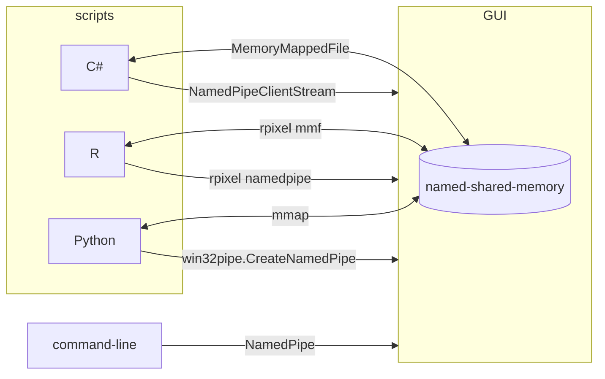

# rhtipc

sending a command using a namedpipe.

## Usage

### commandline

```ps1
# install
ps> cargo install --git https://github.com/haitusense/htipc
# uninstall
ps> cargo uninstall htipc
# help
ps> htipc --help
```

### R

```r
# install
R> install.packages("../htipc/R", repos = NULL, type = "source")
R> install.packages(paste(getwd(), "/R", sep = ""), repos = NULL, type = "source")
# uninstall
R> remove.packages("htipcR")
```

### python

```ps
# environment setup
ps> winget install --id Python.Python.3.12
ps> winget install --id Git.Git
ps> pip install maturin

# install from github
ps> pip install 'git+https://github.com/haitusense/htipc.git#egg=htipcPyo&subdirectory=pyo3'

# uninstall from github
ps> pip uninstall htipcPyo
```

## Description


